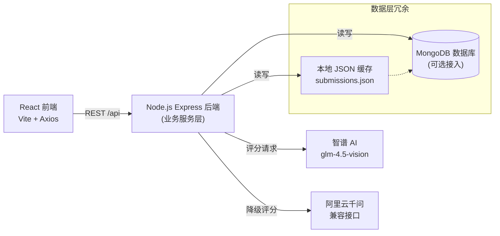

# 雅思写作练习系统设计文档


## 本地运行展示


## 1. 系统架构



- **前端**：React + Vite，负责题目展示、写作输入、字数统计、历史列表与评分呈现，通过 Axios 调用 `/api/*`。
- **后端**：Express 提供 REST API，负责题目管理、评分流程编排、数据持久化、历史查询。
- **存储**：优先连接 MongoDB `ielts_writing` 库，连接失败时自动降级至本地 JSON 缓存文件，保证开发环境快速启动。
- **AI 服务**：优先请求智谱 `glm-4.5-vision`；若失败或无密钥则降级调用千问兼容接口；最终再降级为本地默认评分兜底。

## 2. 数据库设计

### 2.1 Collection：`submissions`

| 字段 | 类型 | 描述 |
| --- | --- | --- |
| `_id` | ObjectId | MongoDB 主键 |
| `promptId` | String | 题目唯一编号（如 `task1`） |
| `promptText` | String | 题目原文，写入时冗余一份便于复核 |
| `answerText` | String | 学员作文全文 |
| `wordCount` | Number | 字数统计，后端按空白分词计算 |
| `scores.taskAchievement` | Number | 任务完成度评分（0-9，可空） |
| `scores.coherence` | Number | 连贯衔接评分（0-9，可空） |
| `scores.lexicalResource` | Number | 词汇丰富度评分（0-9，可空） |
| `scores.grammaticalRange` | Number | 语法多样性评分（0-9，可空） |
| `scores.overall` | Number | 综合评分（四项均值，保留一位小数） |
| `feedback` | String | AI 给出的改进建议，支持多段文本 |
| `createdAt` | Date | 创建时间 |
| `updatedAt` | Date | 更新时间 |

示例文档：

```json
{
  "_id": "671fcb6a8d31f3c9c5ac2c81",
  "promptId": "task1",
  "promptText": "Some people think governments should focus on reducing environmental pollution...",
  "answerText": "In modern cities...",
  "wordCount": 287,
  "scores": {
    "taskAchievement": 7,
    "coherence": 7,
    "lexicalResource": 6.5,
    "grammaticalRange": 6.5,
    "overall": 6.8
  },
  "feedback": "需要进一步扩展第二段论据，并优化连接词使用。",
  "createdAt": "2025-11-02T10:15:00.000Z",
  "updatedAt": "2025-11-02T10:15:00.000Z"
}
```

> 本地缓存模式下，字段结构保持一致，只是存储在 `backend/src/data/submissions.json` 中。

### 2.2 其他集合（可扩展）

- `prompts`：存储更完整的题库信息（题型、难度、标签等），当前由内存常量 `questions.js` 代替。
- `users`：后续如需登录与个性化记录可拓展用户表。

## 3. API 设计

| 方法 | 路径 | 功能 | 请求参数 | 响应示例 |
| --- | --- | --- | --- | --- |
| GET | `/api/health` | 健康检查 | 无 | `{ "status": "ok" }` |
| GET | `/api/questions` | 获取题目列表 | 无 | `{ "data": [{ "id": "task1", "title": "..." }] }` |
| GET | `/api/questions/:id` | 获取指定题目 | 路径参数 `id` | `{ "data": { "id": "task1", "title": "..." } }` |
| POST | `/api/submissions` | 提交作文并触发评分 | JSON：`{ promptId, answerText }` | `{ "data": { id, promptId, scores, feedback, createdAt } }` |
| GET | `/api/submissions` | 查询最新历史记录（最多 50 条） | 可选查询参数（后续扩展） | `{ "data": [{ id, promptId, overall, wordCount, createdAt }] }` |
| GET | `/api/submissions/:id` | 获取某次作答详情 | 路径参数 `id` | `{ "data": { id, answerText, scores, feedback } }` |

约定：
- 成功返回 `{ "data": ... }`，失败时返回 `{ "error": "error_code" }`。
- 字段命名统一使用 `camelCase`。历史列表为轻量数据，可按需扩展分页参数。

## 4. 雅思 API 集成方案

### 4.1 调用顺序

1. 解析前端请求，校验题目与作文内容，并统计字数。
2. 构造统一 Prompt，优先调用 **智谱 AI** `glm-4.5-vision` 模型：
   - 请求地址：`https://open.bigmodel.cn/api/paas/v4/chat/completions`
   - Header：`Authorization: Bearer ${ZHIPU_API_KEY}`，`Content-Type: application/json`
   - 请求体（OpenAI 兼容）：

```json
{
  "model": "glm-4.5-vision",
  "messages": [
    { "role": "system", "content": "You are an IELTS writing examiner." },
    { "role": "user", "content": "{{PROMPT_TEMPLATE}}" }
  ]
}
```

3. 若智谱返回异常或缺少密钥，则降级调用 **阿里云千问** 兼容接口：
   - 地址：`https://dashscope.aliyuncs.com/compatible-mode/v1/chat/completions`
   - Header：同样使用 Bearer Token 与 JSON。
4. 两个服务都失败时，返回本地默认评分（示例值 6 分）和提示语，保证流程不断网。

### 4.2 Prompt 模板

```text
你是雅思写作考官。题目如下：{{promptText}}。考生作文如下：{{answerText}}。请根据雅思写作评分标准输出JSON，字段为taskAchievement、coherence、lexicalResource、grammaticalRange、overall、feedback。评分范围0-9，overall为四个维度平均并保留一位小数，feedback提供改进建议。
```

### 4.3 返回解析

- 后端期望模型返回严格的 JSON 字符串，解析后映射到 `scores` 与 `feedback` 字段。
- 若解析失败（非 JSON 或缺字段），视为调用异常并进入降级流程。
- 为防止模型输出中文键名或额外字段，后端统一使用 `formatResult` 函数进行校验与转换。

### 4.4 安全与运维

- API Key 通过环境变量管理：`ZHIPU_API_KEY`、`QWEN_API_KEY`，本地 `.env` 不提交到仓库。
- 可在生产环境中增加调用限流、日志记录与告警，保障评分服务稳定。

---

文档更新日期：2025-11-02


